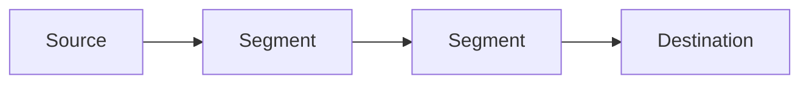
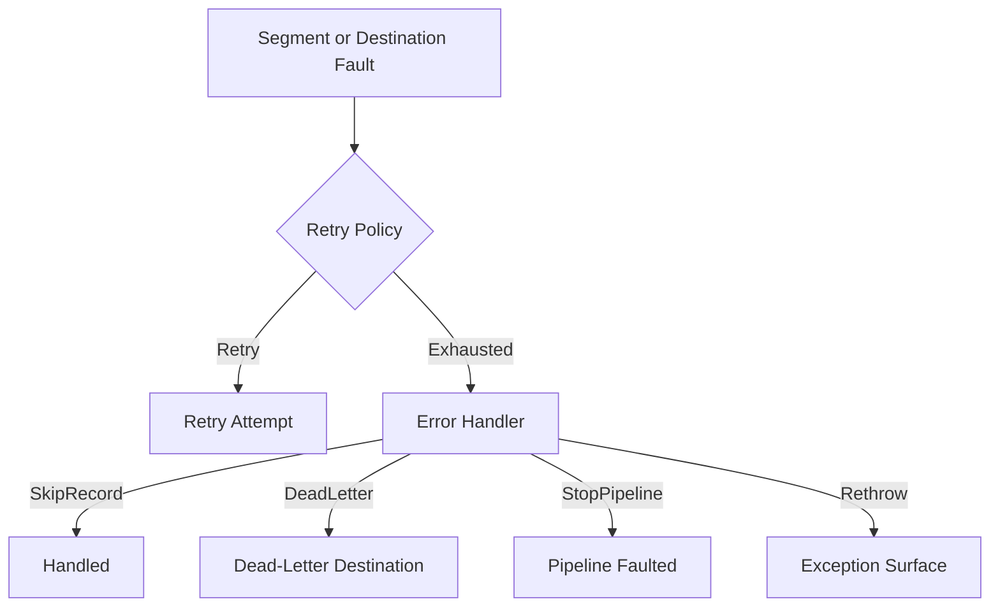

# Runtime Architecture

Audience: contributors and maintainers.

## What This Covers

- how the core runtime is assembled
- how records move through the graph
- where status, fault, retry, and flow-control behavior live

## High-Level Shape

Pipelinez is built on TPL Dataflow.

The runtime graph is assembled during `Build()` and linked before the pipeline is started.

## Container Model

Each record moves through the runtime inside `PipelineContainer<T>`.

That container carries:

- the current record payload
- metadata
- fault state
- segment history
- retry history

This allows the framework to keep payload data and execution context together across the whole pipeline.

## Component Roles

- source:
  ingress, manual publish handling, source-side metadata stamping
- segment:
  transform execution, retry application, segment-history updates
- destination:
  terminal processing, batching, terminal fault handling handoff
- pipeline:
  orchestration, status, events, health, performance, and runtime coordination

## Fault And Retry Flow

## Flow Control

Flow control is layered over bounded-capacity execution settings.

Manual publish goes through:

- source capacity
- configured overflow policy
- publish result handling
- saturation state tracking

## Operational Layer

The operational surface builds on runtime state already collected by the pipeline:

- `GetStatus()`
- `GetPerformanceSnapshot()`
- `GetHealthStatus()`
- `GetOperationalSnapshot()`

## Related Docs

- [Overview](../Overview.md)
- [Architecture: Kafka Internals](kafka.md)
- [Architecture: Testing](testing.md)
